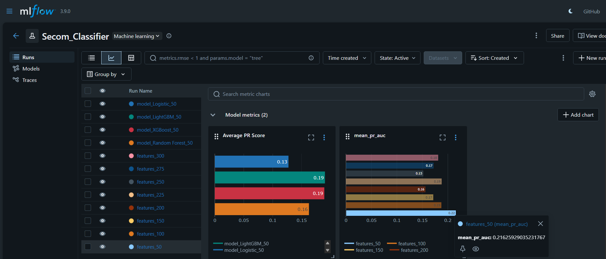
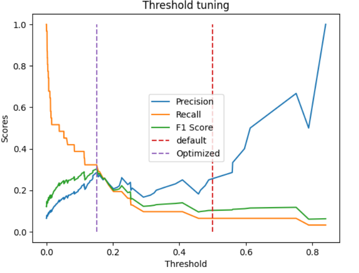

# Secom Failure Classification (End-to-End ML + MLOps)
## Overview
This project focuses on building a robust machine learning pipeline to detect manufacturing failures using the SECOM dataset (high-dimensional, highly imbalanced data).

Dataset Details:
* Rows: 1567
* Columns: 592
* Problem Type: Binary Classification (Highly Imbalanced) (0:1463, 1:104) with target mapping ({-1:0,1:1})

The workflow covers:
- Data preprocessing & feature reduction
- Model experimentation & selection
- MLflow-based experiment tracking
- Hyperparameter tuning of the best model
- Threshold tuning for imbalanced classification
- API deployment using FastAPI
- Containerization with Docker
- Cloud deployment on AWS EC2

## Project Structure
```
├── .github/                 # GitHub Actions workflows (CI/CD pipelines)
├── .dockerignore           # Files ignored during Docker build
├── .gitignore              # Files ignored by Git
├── Dockerfile              # Docker image configuration for deployment
├── README.md               # Project documentation

├── Secom_Notebook.ipynb    # Exploratory data analysis & experimentation
├── config.json             # Stores selected features & decision threshold
├── final_model.pkl         # Trained ML pipeline (production-ready model)

├── main.py                 # FastAPI application (inference API)
├── testing.py              # Script for testing predictions locally
├── sample_test.pkl         # Sample input data for testing API/model

├── requirements.txt        # Python dependencies
```
## Results


1. Feature Selection (Top-K Experimentation) (on right)
   * Evaluated k ∈ [50, 100, 150, 200, 225, 250, 275, 300]
   * Metric: Mean PR-AUC (Stratified K-Fold)
   * Tracked using MLflow
     **Best K=50; PR-AUC: 0.216**
2. Model Comparision (on left)
   * RandomForest, XGBoost, Logistic Regression, LightGBM
   * **Selected LightGBM; PR-AUC: 0.19**
3. Hyperparameter tuning (Optuna)
   * Objective: Maximize PR-AUC
   * Validation: Stratified K-Fold
   * Best Parameters: `{'n_estimators': 353, 'max_depth': 4, 'learning_rate': 0.038782235731028326, 'num_leaves': 92, 'min_child_samples': 50, 'subsample': 0.951684162524425, 'colsample_bytree': 0.7852808947876807}`
   * **Tuned PR-AUC: 0.224** *3.7% improvement from base pr_auc*

Predicted Probabilities on test data and evaluated **Precision**, **Recall**, **F1-Score** at multiple thresholds and optimal threshold is selected based on max **F1-Score** for balanced performance.

### Final Model Performance on Test Data:

**PR-AUC:  0.198**
**ROC-AUC:  0.675**

**Untuned Performance**

| Class | Precision | Recall | F1-Score | Support |
| :--- | :--- | :--- | :--- | :--- |
| **0 (Fail)** | 0.94 | 0.99 | 0.96 | 440 |
| **1 (Pass)** | 0.29 | 0.06 | 0.11 | 31 |
| **Accuracy** | | | **0.93** | 471 |



**Tuned Performance** *@0.151*

| Class | Precision | Recall | F1-Score | Support |
| :--- | :--- | :--- | :--- | :--- |
| **0 (Pass)** | 0.95 | 0.94 | 0.95 | 440 |
| **1 (Fail)** | 0.29 | 0.32 | 0.30 | 31 |
| **Accuracy** | | | **0.90** | 471 |

* Improved Minority Class F1 from (11% → 30%)
* Significant improvement in minority class recall (6% → 32%)

### Final Pipeline
```
SimpleImputer(strategy="median") → VarianceThreshold(threshold=0.01) → SelectKBest(score_func="mutual_info_classif,k=50) → LGBMClassifier(**best_params) → Output
```
This pipeline is saved in local directory using `joblib` as `final_model.pkl` for API deployment

## Data Preprocessing Pipeline
**1. Missng Value Analysis :** Computed null percentage per columns and selected a cutoff of 60 % through histogram, dropping columns having >60% of null values.\
**2. Feature Reduction :** Applied Variance Threshold reducing 566 → 301 columns.\
**3. Imputation :** Used Median to impute Missing Values.\
**4. Stratified Train Test Split :** to preserve class distribution in both train and test datasets.

## Feature Selection Strategy
* Used **SelectKBest(mutual_info_classif)**
* Evaluated multiple *k* values: [50,100,150,200,250,275,300]
* Tracked experiments using **MLFlow**
* Metric used: **PR-AUC** for comparision across k values on different folds (n_splits=5) aggregated PR-AUC across folds for different k values on **validation data** subsetted from training data with preserved class balance.
**Selected Top k(50)** features based on the best aggregated **PR-AUC** across splits for stability.

## Model Training & Comparision
Trained multiple models with selected top 100 features evaluated using PR-AUC
* RandomForest
* XGBoost
* LightGBM
* Logistic Regression (with scaled data)

Handling Imbalance
* `class_weight="balanced"` (where applicable)
* LightGBM → `scale_pos_weight`\
**Best Model: LightGBM, PR-AUC: 0.19** (outperformed all other models)

## Hyperparameter Tuning on validation data for LightGBM using optuna for max PR-AUC Scoring
* Tuned:
  * `n_estimators` ,`max_depth`, * `min_child_samples`, `learning_rate`, `num_leaves`, `sub-sample`,
`colsample_bytree`
* Selected best configuration based on mean PR-AUC across folds.

## Configuration Management 
Saved in (config.json):
* Selected features (Top 50)
* Optimal threshold

## API Deployment
Built inference API using **FastAPI**
Features:
* Loads trained model
* Raises error on missing features
* Used Tuned threshold
* Returns classification output and probability of pass or fail

## Dockerization through GitHub Actions (CI/CD)
* Created workflow to auto build docker image of the fastapi applicaiton.
* Pushed image to [Docker Repository](https://hub.docker.com/repository/docker/abhinay1289/secom-app) for serving the model

## Cloud Deployment
* Deployed on **AWS(Amazon Web Services) EC2** (Ubuntu instance)
* Pulled Docker image in the instance and served API on cloud

## Try it out
run `docker pull abhinay1289/secom-app:latest`\
run `docker run -p 8000:8000 abhinay1289/secom-app:latest`\

access API on `http://localhost:8000` and interactive docs on `http://localhost:8000/docs`\

*Example response*
```
{
    "prediction": prediction,
    "prob_pass": float(pass_prob),
    "prob_fail": float(fail_prob),
    "threshold":threshold}  # returing threshold for debugging purposes
```
